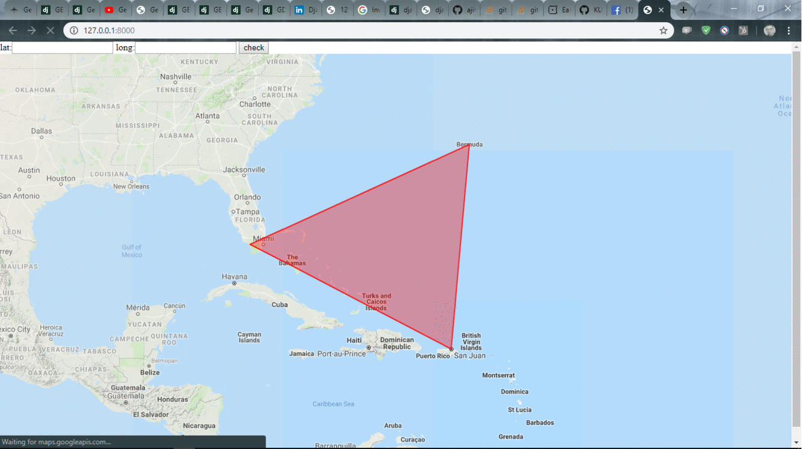

# Poly

## Packages Used:
   * django
   * GIS
   * GDAL == 3.00
   
## Cocept Used:
   Intersection of a point with edge of the polygon by extending it infinitely towards one of the either side.
   
## Installation:
   * pip install django

   * pip install GDAL
   
   * run "python manage.py runserver"
   
   * open http://127.0.0.1:8000/ in browser
   
### Troubleshoot:
* check your GDAL version in {Python root}\Lib\site-packages\osgeo in my case C:\Python37\Lib\site-packages\osgeo and add    *  
* your version of gdal in line 26 in C:\Python37\Lib\site-packages\django\contrib\gis\gdal/libgdal.py

## Guide to project:
  The application uses "gis" library for forming geospatial geometry(eg. Polygon, points with given lattitute and longitude). Although, it has a hard coded polygon as of now, but it can be tweak by changing "index.html", where co-ordinate has been coded. Also, it uses a google map API (developer version), which limits it's interaction capability.
  
 
 
 ## Future Improvements:
   * Making more user interactive version where user provides polygon points.
   * Use of an advanced version of google API or openstreetmap.
   * Try to use more optimize point intersection algorithm.
   
